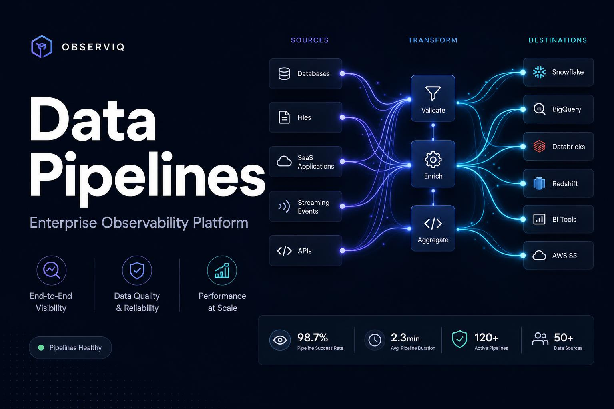

# Pipeline Pulse — Enterprise Data Pipeline Observability

[](https://lovable.dev)
[](./LICENSE)
[](https://tanstack.com/start)
[](https://workers.cloudflare.com)

> Production-grade control plane for data pipelines. Monitor jobs, trace lineage, detect anomalies, and ship architecture docs — all in one place.

**Live demo:** https://pipeline-pulse-79.lovable.app
**60-second walkthrough:** [`/demo`](https://pipeline-pulse-79.lovable.app/demo) · [`public/demo.mp4`](./public/demo.mp4)



---

## ✨ Highlights

- **DMBOK Academy** 🎓 — the teaching layer for CDMP aspirants and DAMA study groups:
  - **Learning Hub (`/learn`)** — interactive DAMA Wheel (Data Governance at the hub, 10 KAs on the ring), the Aiken pyramid, and the environmental-factors hexagon, each clickable through to live modules
  - **CDMP Practice Mode (`/quiz`)** — 87 original practice questions with explanations, per-chapter drills + a cross-chapter mock exam, best-score tracking, and LinkedIn-shareable results
  - **Trainer Kit (`/trainer`)** — the "Meridian Retail" running case study, per-chapter facilitator one-pagers (print / PDF / Markdown), warm-up questions, and ready 60-minute & half-day workshop agendas
  - **DMBOK Lens** — every module page carries a collapsible panel mapping that screen to its DMBOK2 chapter: goals, activities, deliverables, roles, metrics, and CDMP exam pointers
- **Complete DMBOK2 coverage** — all 17 chapters: the 11 wheel knowledge areas + 3 extended disciplines (Ethics, Big Data & AI, Maturity) + 2 organizational enablers (Org & Roles with a RACI matrix, Change Management with Kotter tracking) + the Ch 1 foundation
- **Real-time Overview** — KPIs, execution trend, system pulse, freshness scoreboard
- **DAMA Guided Demo Mode** — global 1-minute and 10-minute walkthroughs for portfolio, interview, and executive review flows
- **Job Manager** — Lifecycle controls, log viewer, and an **AI Job Config Generator** (`"ETL from Salesforce to Snowflake nightly, retry 3x"` → filled form)
- **Pipeline Maps (Lineage)** — End-to-end DAG with asset search, metadata panels, and **AI Impact Analysis** on every node (plain-English blast radius)
- **Architecture Viewer** — System diagrams with **one-click narrated PDF export**
- **Audit Trail** — Full event log with **AI Anomaly Detection** (off-hours access, foreign IPs, sensitive changes)
- **Metadata-Driven Data Quality Control Center** — Governed, auditable validation with editable rule catalog, domain scorecards, trend analytics, reconciliation, audit evidence, incident workflow, and business impact view
- **Document & Content Governance** — Unstructured PII scan simulation, OCR extraction examples, legal hold queue, and exportable synthetic evidence
- **MDM & Reference Data** — Golden record view plus side-by-side duplicate merge review with survivorship recommendation and steward escalation
- **AI Governance Model Cards** — Training lineage, evaluation metrics, fairness checks, approval history, and decommission triggers
- **Catalog & Glossary Adoption** — Search/filter, tag cloud, completeness formula, harvesting simulation, and glossary approval flow
- **Multi-tenant** — Tenants, contracted hours, billing rates, usage alerts
- **Incidents & Projects** — Severity tracking, ownership, cross-tenant pipeline projects
- **Live visitor counter** on the homepage

## 🛠 Tech Stack

- **Framework:** TanStack Start v1 (React 19, SSR-ready, Vite 7)
- **Styling:** Tailwind CSS v4 + shadcn/ui + semantic OKLCH tokens
- **Charts:** Recharts
- **Motion:** Framer Motion
- **Deploy:** Cloudflare Workers (via `@cloudflare/vite-plugin`)
- **Built with:** [Lovable](https://lovable.dev)

## 🚀 Quick Start

```bash
bun install
bun run dev          # http://localhost:5173
bun run build        # production build
```

> **Putting this in your own GitHub repo?** Follow the step-by-step guide in [GIT_SETUP.md](./GIT_SETUP.md).

## 🗺 Pages

| Route           | Purpose                                                        |
| --------------- | -------------------------------------------------------------- |
| `/`             | Overview — KPIs, trends, system pulse                          |
| `/learn`        | 🎓 DMBOK2 Learning Hub — interactive DAMA Wheel, pyramid, hexagon |
| `/quiz`         | 🎓 CDMP practice questions + mock exam with shareable results   |
| `/trainer`      | 🎓 Trainer Kit — case study, one-pagers, workshop agendas       |
| `/dama`         | DAMA Control Tower — 17-chapter maturity heatmap & evidence    |
| `/jobs`         | Job Manager + AI config generator                              |
| `/lineage`      | Pipeline Maps with AI impact analysis                          |
| `/architecture` | System diagrams + narrated PDF export                          |
| `/audit`        | Audit log with AI anomaly detection                            |
| `/dq`           | Metadata-Driven Data Quality Control Center                    |
| `/stewardship`  | Steward queues + RACI operating model + change management      |
| `/incidents`    | Active incidents                                               |
| `/projects`     | Cross-tenant pipeline projects                                 |
| `/tenants`      | Tenant management, contracts, billing rates                    |
| `/billing`      | Usage & alerts                                                 |
| `/settings`     | Org preferences & integrations                                 |

## 🛡 Data Quality Control Center (`/dq`)

A governed, metadata-driven validation workspace that turns ad-hoc checks
into an auditable enterprise capability.

- **Initial state:** only the **Incoming Feed**, **Metadata Rules**, and a
  **Run Data Quality Validation** button are visible — no premature results.
- **On run:** results, reconciliation, rejected/quarantine/golden datasets,
  analytics, audit evidence, incident workflow, and business impact tabs are
  revealed with an animated 10-step validation progress (demo dataset:
  93 passed, 6 rejected, 1 quarantined).
- **AI Rule Assistant:** suggests new metadata rules from the observed
  feed schema.
- **Positions the platform** for data governance, DataOps maturity, and
  converting fragmented manual validation into a scalable, auditable
  capability with clear business impact.

## 🧭 DAMA DM-BOK2 Demo Flow

Use the floating **Demo Guide** button on any page for:

- **1-Minute Overview:** Overview → DAMA Control Tower → Governance → DQ Control Center → AI Governance
- **10-Minute Deep Dive:** Adds Lineage, MDM, Document & Content, Catalog, Learning Hub, and Executive Governance

The app remains a client-side synthetic portfolio simulation. All DAMA improvements preserve the existing Lovable visual system and use local React state only.

### How the coverage maps to DMBOK2 (the accurate framing)

DAMA's DMBOK wheel officially contains **11 knowledge areas** (chapters 3–13). This platform
covers **all 17 DMBOK2 chapters**:

| Group                        | Chapters | Coverage                                                            |
| ---------------------------- | -------- | ------------------------------------------------------------------- |
| Foundation                   | Ch 1     | Data Management → `/value`                                           |
| **DMBOK Wheel (11 KAs)**     | Ch 3–13  | Governance, Architecture, Modeling, Storage & Ops, Security, Integration, Docs & Content, Reference & Master, DW/BI, Metadata, Data Quality |
| Extended disciplines         | Ch 2, 14, 15 | Data Handling Ethics → `/ethics`, Big Data & AI → `/ai-governance`, Maturity Assessment → `/dama` |
| Organizational enablers      | Ch 16, 17 | Org & Roles (RACI) and Change Management (Kotter) → `/stewardship`   |

> ⚠️ Not "14 pillars" — CDMP-certified reviewers will look for the 11-knowledge-area wheel.
> The Learning Hub (`/learn`) renders it interactively.

## 🔒 Security & Best Practices

- Strict CSP-friendly stack — no inline secrets, no API keys in client code
- Semantic design tokens only (no hard-coded colors)
- SEO: meta tags, OG image, sitemap, robots.txt, `llms.txt`
- Accessibility-first shadcn primitives (Radix under the hood)

## 📺 Demo Video

A 15-second motion reel lives at [`/public/demo.mp4`](./public/demo.mp4).

## 📄 License

Demo project — MIT-style, free to fork and remix.

---

Built with ❤️ on [Lovable](https://lovable.dev) for the **May 23–25, 2026 weekend builder contest**.
